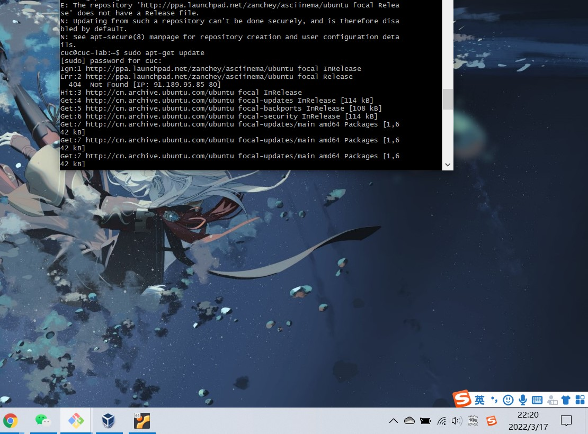
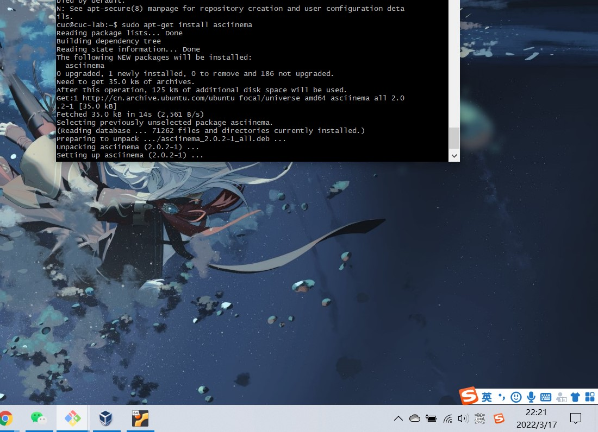
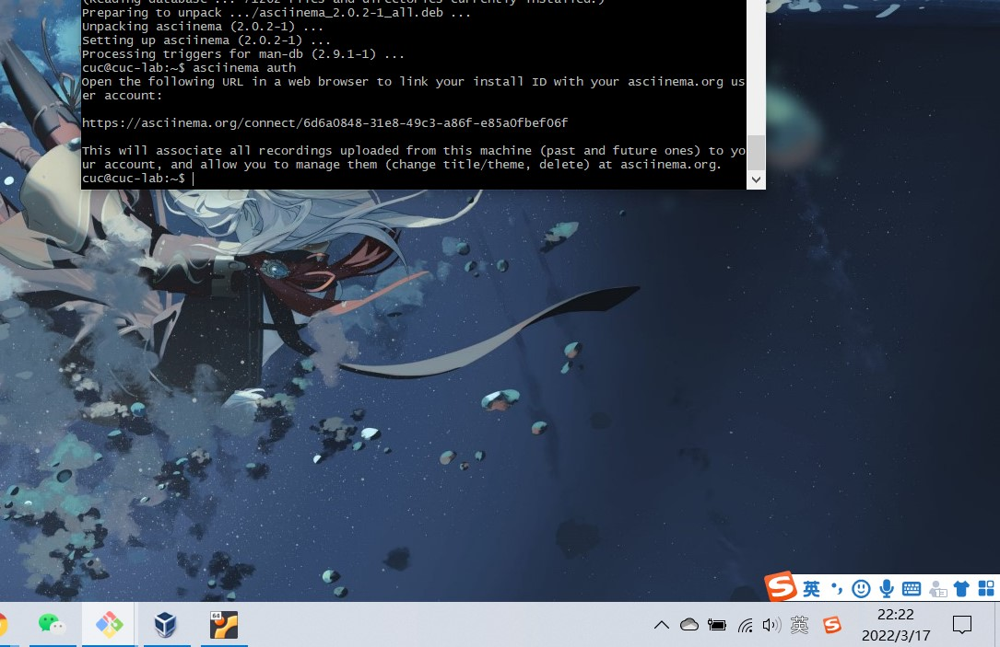
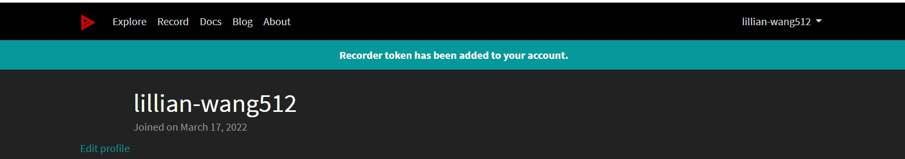
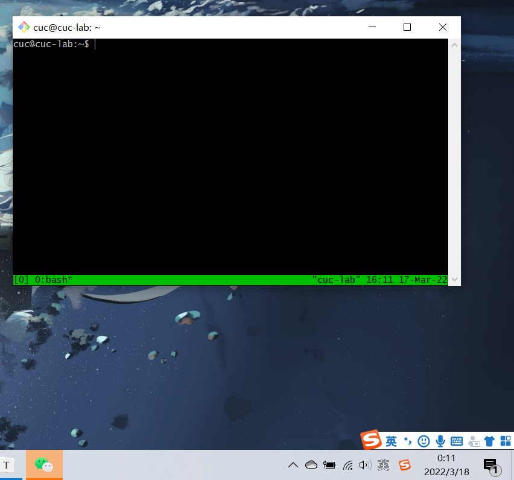
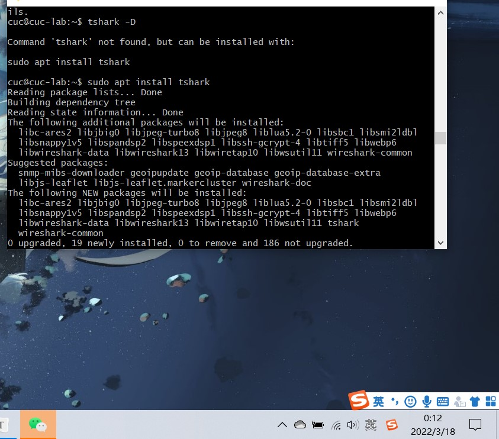
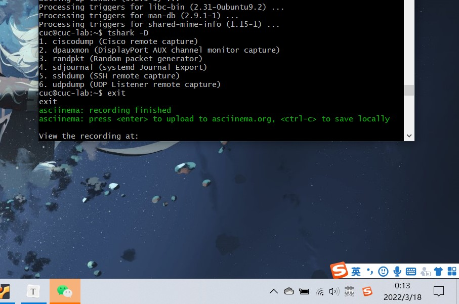
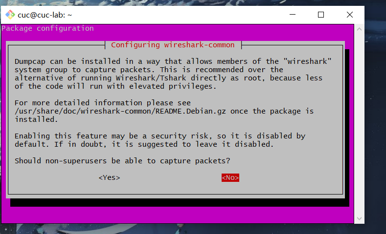

# linux第二章实验

### 一、安装好`asciinema`

#### 1、ububtu

[ubuntu安装asciinema官网资料]: https://asciinema.org/docs/installation#installing-on-linux

```linux
sudo apt-add-repository ppa:zanchey/asciinema
sudo apt-get update
sudo apt-get install asciinema
```











#### 2、centos

centos安装资料（官网上没找到，查资料发现是需要用yum写的）

对于 CentOS/RHEL 用户，使用 [YUM 命令](https://link.zhihu.com/?target=https%3A//www.2daygeek.com/yum-command-examples-manage-packages-rhel-centos-systems/) 来安装 pip 包。

```linux
$ sudo yum install python-pip
```

最后，运行如下的 [pip 命令](https://link.zhihu.com/?target=https%3A//www.2daygeek.com/install-pip-manage-python-packages-linux/) 来在 Linux 上安装 Asciinema 工具。

```linux
$ sudo pip3 install asciinema
```

[centos安装asciinema资料]: https://zhuanlan.zhihu.com/p/56376724


### 二、软件包管理

#### 1.【软件包管理】：在目标发行版上安装 `tmux` 和 `tshark`

##### (1).ununtu

```linux
sudo apt update && sudo apt install tmux
sudo apt install tshark
```

第一个安装的视频不知道什么原因有的地方缺失了（我有注意到不去调整窗口大小），其他视频是完好的，所以为了补充第一个视频缺失的部分就截图补充一下。

[](https://asciinema.org/a/OjWcjzNCM8Sorn6HrHIxUUc3E)

由于tmux后来寻找截图的时候命令被吞掉了找不到，就只有检查tmux是否安装好的截图了








##### (2).centos

```linux
yum install tmux
```

```linux
yum install wireshark   #centos上只有wireshark
```

[](https://asciinema.org/a/wQ1OvDjWr05W8WFW9Zo8zbmYA)


#### 2.【软件包管理】:查看`tmux`和`tshark`被安装到哪些路径

##### (1).ununtu

```linux
apt-cache depends tmux     #查看tmux的依赖包
dpkg -L tmux
```

```
apt-cache depends tshark  #查看tshark的依赖包
dpkg -L tshark    
```

[](https://asciinema.org/a/FBqUt8qXicLIGAaYStANUCHaU)

##### (2).centos

```linux
 rpm -qal | grep tmux       		 #查看tmux安装路径  
```

```linux
 rpm -qal | grep wireshark           #查看tshark安装路径 
```

[](https://asciinema.org/a/s2xDc7SCqpk9gGgnSRSCOFWUi)


#### 3.【软件包管理】:卸载`tshark`

##### (1).ubuntu

```linux
apt-get --purge remove tshark     # 删除软件及其配置文件
apt-get autoremove tshark         # 删除没用的依赖包       
```

[](https://asciinema.org/a/46l2zjEqdRSwvWnOtM4EAQrvm)

##### (2).centos

```
yum -y remove wireshark 
```

由于存在可能卸载了依赖包就出现无法挽回的bug的情况，所以只卸载了软件，没有卸载依赖包。

[](https://asciinema.org/a/8kcfNcFiCtyskRPQKSHBiU6Gm)


#### 4.【软件包管理】:验证 `tshark` 卸载结果

##### (1).ubuntu

```
dpkg -L tshark
```

[](https://asciinema.org/a/jIybi7XY6c1EKgH99sQxzZvkF)

##### (2).centos

```linux
rpm -qal | grep wireshark 
```

[](https://asciinema.org/a/QhS9Oo1pDyLlB3hNTW3rVqssH)


### 三、文件管理

【文件管理】：

找到`/tmp`下文件名和文件夹包含666的文件

##### 1.ubuntu

##### 找到`/tmp`下文件名和文件夹包含666的文件（和在一起了）

```linux
cd /tmp && for i in $(seq 0 1024);do dir ="test-$RANDOM";mkdir "$
dir";echo "$RANDOM" > "$dir/$dir-$RANDOM";done              #shell

find | grep 666    #找到文件名含有666的

grep -r 666        #找到文件内容有666的
```

[](https://asciinema.org/a/dZBOs4yQzD4KR1tLGDJUVcPG4)

##### 2.centos

###### (1).找到文件内容包含666的文件

```linux
cd /tmp     
sudo grep -r "666" ./ --exclude=*.cast 
```

[](https://asciinema.org/a/qhX4ulWAEd00mxzK62msYrA1J)

###### (2).找到文件名含666的文件

```linux
cd /tmp
sudo find ./ -type f -name "*666*"   
```

[](https://asciinema.org/a/NzPrzECLUU7OYEojvNMxwVzOM)


### 四、【文件压缩与解压缩】练习课件中 [文件压缩与解压缩](https://c4pr1c3.github.io/LinuxSysAdmin/chap0x02.md.html#/12/1) 一节所有提到的压缩与解压缩命令的使用方法

这里ubuntu和centos方法一样，就只做了一个

```
压缩：
tar: tar -cvf examples.tar examples
gzip: gzip -r examples.gz examples
zip: zip -r examples.zip examples (examples为目录)
7z(p7zip)：7za a examples.7z exampes
bzip2：bzip2 -v8 example（不能压缩文件夹，只能压缩里面的文件，而且文件内容不能为空）
解压缩：
tar: tar -xvf examples.tar 
gzip: gunzip -r examples.gz 
zip: unzip examples.zip 
rar: unrar examples.rar
7z(p7zip)：7za e examples.7z 
bzip2：bzip2 -d example.bz2
```

[](https://asciinema.org/a/fMsaxsyzbqdusxdYyEjcGqwzP)


### 五、 子进程管理实验

- 【跟练】 子进程管理实验

[](https://asciinema.org/a/Q4byRTpCBrOp8RmikdQyAB4I7)


### 六、硬件信息获取

【硬件信息获取】目标系统的 CPU、内存大小、硬盘数量与硬盘容量

#### 1.ubuntu

```linux
grep "model name" /proc/cpuinfo |awk -F ':' '{print $NF}'       #查看cpu型号    
cat /proc/cpuinfo | grep "physical id" | uniq | wc -l           #查看cpu个数
cat /proc/cpuinfo | grep "cpu cores" | uniq  					#查看cpu核数 
```

```linux
cat /proc/meminfo | grep MemTotal 						#查看内存 
sudo fdisk -l | grep Disk                				#查看硬盘     
```

[](https://asciinema.org/a/uESxZ48phcUHsoUHO99jqIwDy)

#### 2.centos

##### (1).cpu

[](https://asciinema.org/a/tUCznvpZZ2Z9hufLjlR5w40JA)

##### (2).内存

[](https://asciinema.org/a/XtFAHFiltjuuwzlTyvfFfIAQ8)

##### (3).硬盘容量

[](https://asciinema.org/a/N1jXl3TkJKC59LdPeT9bo8t5R)


### 七、表格总结

|       linux发行版本       |                         Ubuntu 20.04                         |                 CentOS 7.7                  |
| :-----------------------: | :----------------------------------------------------------: | :-----------------------------------------: |
|      **安装软件包**       |               `sudo apt install <packagename>`               |         `yum install <packagename>`         |
|      **更新软件包**       |               `sudo apt update <packagename>`                |         `yum update <packagename>`          |
|  **查看软件包安装路径**   |                   `dpkg -L <packagename> `                   |       `rpm -qal | grep <packagename>`       |
|                           |      `apt-cache depends <packagename> `    #查看依赖包       |                                             |
|      **卸载软件包**       | `apt-get --purge remove <packagename> `     # 删除软件及其配置文件 |        `yum -y remove <packagename>`        |
|                           | `apt-get autoremove <packagename> `        # 删除没用的依赖包 |                                             |
|      **查看文件名**       |                     `find |grep <name>`                      |    `sudo find ./ -type f -name "<name>"`    |
|     **查看文件内容**      |                        `grep -r 666`                         | `sudo grep -r "<name>" ./ --exclude=*.cast` |
|     **文件压缩**`tar`     |               `tar -cvf examples.tar examples`               |                    同左                     |
|    **文件解压缩**`tar`    |                   `tar -xvf examples.tar`                    |                    同左                     |
|    **文件压缩**`gzip`     |                `gzip -r examples.gz examples`                |                    同左                     |
|   **文件解压缩**`gzip`    |                  ` gunzip -r examples.gz `                   |                    同左                     |
|     **文件压缩**`zip`     |       `zip -r examples.zip examples` (examples为目录)        |                    同左                     |
|    **文件解压缩**`zip`    |                    ` unzip examples.zip `                    |                    同左                     |
|  **文件压缩**`7z(p7zip)`  |                 `7za a examples.7z exampes`                  |                    同左                     |
| **文件解压缩**`7z(p7zip)` |                     `7za e examples.7z `                     |                    同左                     |
|    **文件解压缩**`rar`    |                     `unrar examples.rar`                     |                    同左                     |
|   **文件解压缩**`bzip2`   | `bzip2 -v8 example`（不能压缩文件夹，只能压缩里面的文件，而且文件内容不能为空） |                    同左                     |
|   **文件解压缩**`bzip2`   |                    `bzip2 -d example.bz2`                    |                    同左                     |
|  **硬件信息获取（CPU）**  | `grep "model name" /proc/cpuinfo | awk -F ':' '{print $NF}'`       #查看cpu型号 |                    同左                     |
|                           | `cat /proc/cpuinfo | grep "physical id" | uniq | wc -l`   #查看cpu个数 |                    同左                     |
|                           | `cat /proc/cpuinfo | grep "cpu cores" | uniq  `				        #查看cpu核数 |                    同左                     |
| **硬件信息获取（内存）**  |      `cat /proc/meminfo | grep MemTotal `	#查看内存       |                    同左                     |
| **硬件信息获取（硬盘）**  |                 `sudo fdisk -l | grep Disk`                  |    `df -hl`     #查看硬盘数量与硬盘容量     |
|                           |                                                              |       `df -h`      #查看磁盘剩余空间        |


### 八、问题与思考

1.报错（粉色弹窗）

https://blog.csdn.net/qwqw3qee/article/details/90546564

这个只是一个提示信息，点yes就行



2.在CentOS发行版本上安装tshark时，无法安装

因为CentOS发行版本为安装包wireshark，用wireshark软件包。（会有提示信息的）


### 九、参考资料

[加解压文件资料1](https://blog.csdn.net/weixin_43582443/article/details/115176004 )

[加解压文件资料2]( https://www.cnblogs.com/wxlf/p/8117602.html )

[加解压文件资料2]( https://blog.csdn.net/afei__/article/details/82619843 )

[rar加解压](https://blog.51cto.com/oldboy/597515 )

[gzip加解压](https://www.cnblogs.com/weixun/p/3151988.html )

[bzip2加解压](https://blog.csdn.net/belen_xue/article/details/51635460 )

[7zip](https://www.cnblogs.com/tommy-huang/p/13810508.html )

[centos安装asciinema资料](https://zhuanlan.zhihu.com/p/56376724 )

[ubuntu安装asciinema官网资料](https://asciinema.org/docs/installation#installing-on-linux )

[卸载资料](https://blog.csdn.net/get_set/article/details/51276609)